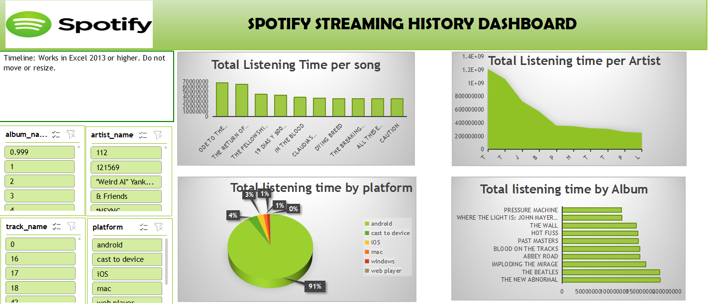

# Project 1

**Title:** [Spotify Streaming History Dashboard](https://github.com/TY-tech01/TY-tech01.github.io/blob/main/spotify%20streaming%20history%20Dashboard.xlsx)

**Tools Used:** Adavance Microsoft Excel (Pivot table, Pivot Chart, Slicers, Timeline)

**Project Description:** This project involved analysing listening data of Spotify to identify trends and patterns for how music are listened to on spotify. It is designed to provide a comprehensive overview of key performance metrics. This dashboard allows stakeholders to easily monitor and analyze Spotify performance across different platform, artist, songs and album. The dashboard includes the following features:

Total Listening Time per song: Visual representation of the total time the top 10 songs are listened t in milliseconds.

Total Listening Time by Artist: A chart representation of the top 10 most listenedto artist.

Total Listening Time by Album: Displays the top 10 album most listened to.

Total Listening Time by Platform: Highlights the platform most used for spotify.

Additionally, the dashboard includes interactive slicers and timeline for:

Year: Filter the data to view performance trends for each year from 2013 t0 2024.

Platform: Drills down the platform used to listen to each song/album/artist the most.

Shuffle: Drill down into if the songs are shuffled randomly or delibrately played.

**Key findings:** Total Listening time per song: Identified the song most listen to on spotify.

Total Listening time per Artist: Revealed the artist that is most listened to.

Platform Used: Highlighted which platform is used to listen to spotify the most.

Yearly Trends: This give an insight on the year spotify sales drives up the most by listening time from 2013-2024.

This dashboard serves as a crucial tool for Spotify management team, providing clear, actionable insights that drive informed decision-making and strategic planning on which platform to increase marketing on or invested in more or which artist or song should be promoted.

**Dashboard Overview:**

# Project 2

**Title:** Workplace Safety Data

**SQL Code:** [Workplace Safety Sql Code](https://github.com/TY-tech01/TY-tech01.github.io/blob/main/Workplace_Safety_Data.sql)

**SQL Skills Used:**
Data Retrieval (SELECT): Queried and extracted specific information from the database.
Data Aggregation (SUM, COUNT): Calculated totals, such as sales and quantities, and counted records to analyze data trends.
Data Filtering (WHERE, BETWEEN, IN, AND): Applied filters to select relevant data, including filtering by ranges and lists.
Data Source Specification (FROM): Specified the tables used as data sources for retrieval.
Common table expression (WITH): Create a temporary result set referenced with SELECT.

**Project Description:**  This project involved analysing data OF workplace safety, to identify trends and patterns of the most common work place injury and how its costs the company. It is designed to provide a comprehensive overview of key safety metrics. This dashboard allows stakeholders to easily monitor and analyze the safety of each employee at their different plants, cost of each incidents for the company, and how much days are lost per years as a results of each incidents. The code shows the following features:

The amounts of incidents that occurred at each plant?

The total incident cost per department?

The incident type that resulted in the highest total days lost?

The distribution of incident types by shift?

The average incident cost for each injury location?

The age group that has the highest number of incidents?

Incidents reported as 'Lost Time' by each plant?

Department that had the highest number of 'Crush & Pinch' incidents?

The plants that reported the most "Near Miss" incidents?

The total number of incidents by year and month?

The gender that has the most reported incidents?

The total cost of incidents per year?

The incident that resulted in the highest cost?

The total cost of incidents for each report type?

The Departments that had incidents with more than 2 days lost?

The average number of days lost per incident type?

The distribution of incidents by shift (Day, Afternoon, Night)?

The months that has the highest number of incidents?

The total cost of "Vehicle" related incidents?

The age group most affected by "Falling Object" incidents?
 
**Technology used:** SQL server

# Project 3

**Title:** [HR Dashboard](https://github.com/TY-tech01/TY-tech01.github.io/blob/main/HR%20Dashboard.pbix)

**Tools used:** Power BI: Power Query, DAX, Dashboards, Source connection and Transformation

**Project Description:** The dashboard provides a holistic view of the employee lifecycle and key HR metrics. It also provides comprehensive insights into the company's workforce, enabling HR professionals to make data-driven decisions that improve employee engagement, optimize HR processes, and support overall organizational success. The dashboard includes the following features:

Total Number Of Employee

Total Number and percentages of Male and Female Employee.

Total Service Years.

Total Number and percentages of Employees due for promotion and Not due for Promotion.

Various Job levels

Active Employees and Employees Due for retirement.

Distance Employees travels to work.

**Key Findings:**

There are more Male Employees than Female As 60% Of the total Employees are Male.

8% of the total Employees are due for retirement so there will be need for recruitement.

About 4.90% of the Employees are due for promotion.

Mosts of the Employees are in Level 1 and 2 of the organization.

More than 60% of the employees live close enough to work.

More than 200 of the Employees has spent over 10 years in the Organization.

**Dashboard Overview:**

(POWERBI.png)
